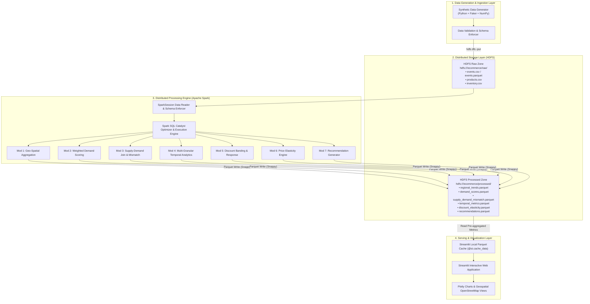
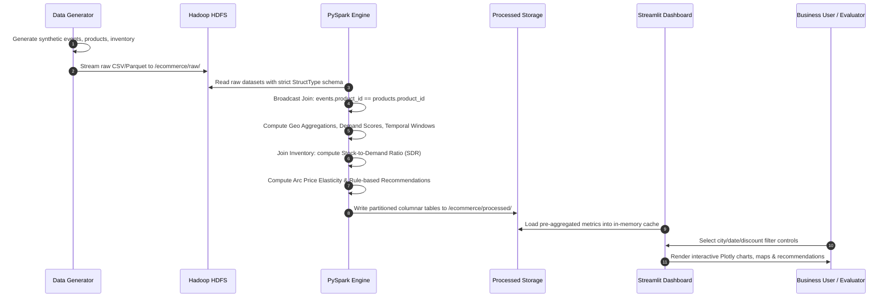
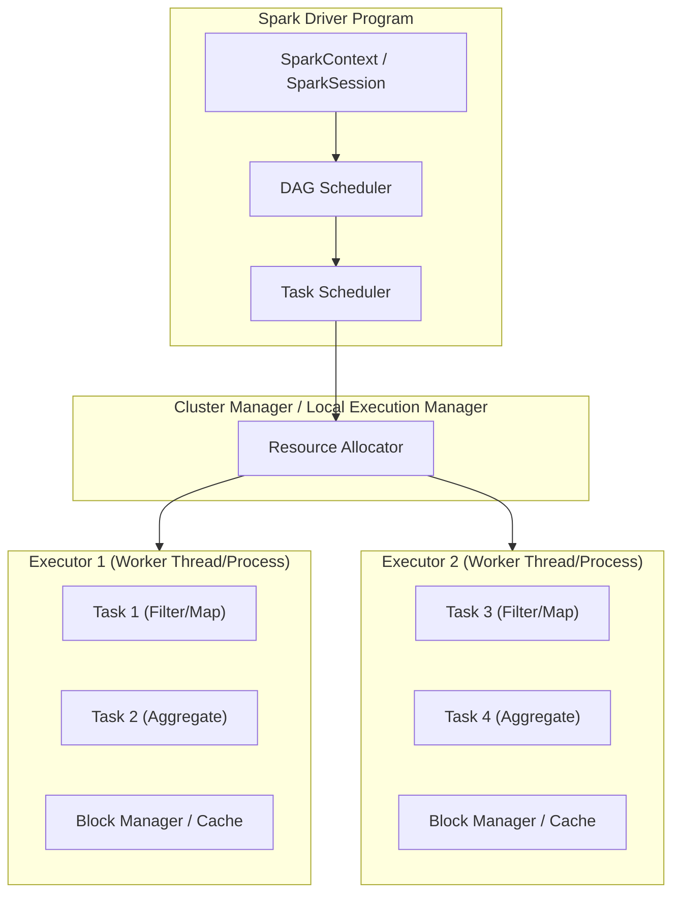
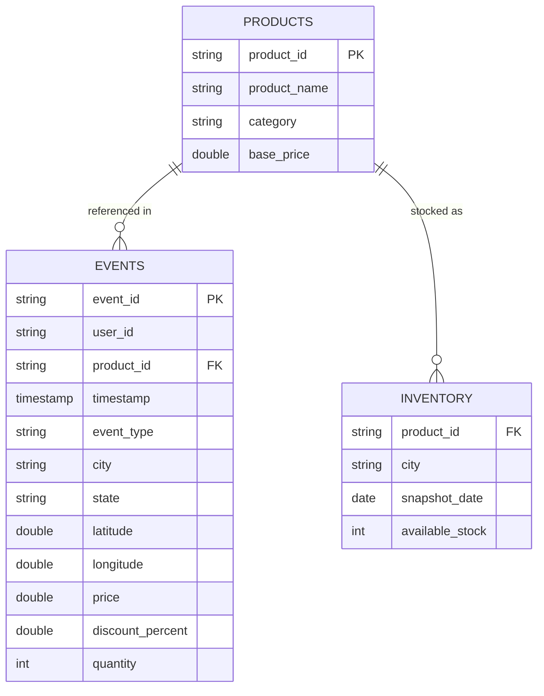
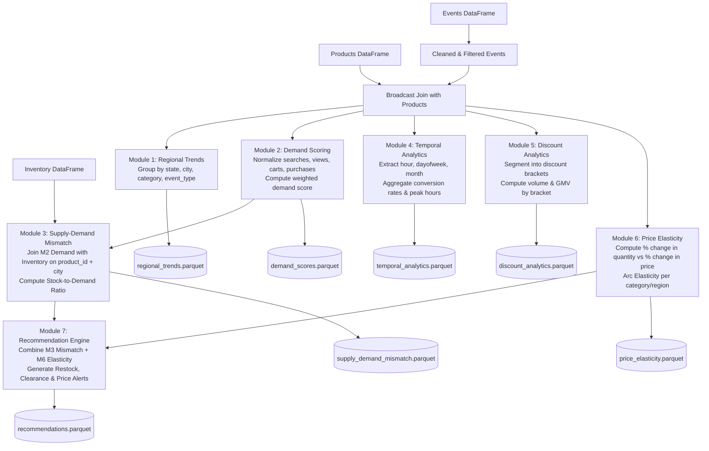

# System Architecture Document

**Project Title:** Geo-Spatial E-Commerce Analytics: Scalable Location-Aware Trend Detection and Discount Optimization Using Apache Spark  
**Academic Context:** Big Data Analytics (BDA) Academic Mini-Project  
**Document Version:** 1.0.0  
**Status:** Approved Baseline  

---

## 1. High-Level Architecture Overview

The system processes multi-million synthetic e-commerce clickstream events and inventory snapshots to deliver location-aware trend detection, supply-demand balancing, and discount price elasticity analytics. 

The architecture is built on a four-tier distributed data computing pattern:
1. **Data Ingestion Tier:** Synthetic event generation and schema validation.
2. **Distributed Storage Tier (HDFS):** Scalable, fault-tolerant block-level storage for raw logs and intermediate data.
3. **Distributed Compute Tier (Apache Spark / PySpark):** In-memory distributed data transformations, Catalyst query optimization, windowing, and aggregations.
4. **Analytical Serving & Visualization Tier (Streamlit + Plotly):** Interactive, low-latency analytical consumption for vendor decision-making.



---

## 2. End-to-End Data Flow

The data flows deterministically through seven sequential stages, guaranteeing traceability, immutability of raw records, and reproducibility of analytical outputs.



---

## 3. Component Architecture

The system is decomposed into discrete, loosely coupled components:

| Component | Technology | Responsibility | Interfaces |
| :--- | :--- | :--- | :--- |
| **Generator Service** | Python 3.x, Faker, NumPy | Creates scalable, statistically sound clickstream logs and inventory snapshots. | Outputs CSV/Parquet files to local staging or directly to HDFS. |
| **Storage Daemon** | Hadoop HDFS (v3.3+) | Manages distributed data blocks across nodes with replication and high read throughput. | WebHDFS API, Hadoop CLI (`hdfs dfs`). |
| **Transformation Pipeline** | PySpark (Spark 3.4+), Spark SQL | Performs ETL, schema casting, distributed joins, windowing, and aggregation. | Spark DataFrame API, Catalyst Optimizer. |
| **Analytics Modules** | PySpark Python modules | Computes specialized business logic (demand, mismatch, elasticity, recommendations). | Internal Python package calls. |
| **Serving Layer** | PyArrow, Fastparquet | Reads processed Parquet summaries into vectorized memory structures. | File system I/O. |
| **Visual Presentation** | Streamlit, Plotly | Provides responsive web dashboard, filter states, maps, and CSV exports. | Web browser (Port 8501). |

---

## 4. Hadoop HDFS Architecture

### 4.1 HDFS Daemon Topology
In an academic/local deployment, HDFS runs in pseudo-distributed or multi-node local cluster mode:
- **NameNode:** Manages the directory tree, file namespace, and block locations in memory. Serves metadata requests.
- **DataNode:** Stores physical 128 MB blocks on local disk storage, reports block heartbeats to NameNode.
- **Secondary NameNode:** Performs periodic checkpoints of the NameNode `fsimage` and `editlog`.

```
                  ┌──────────────────────┐
                  │   HDFS NameNode      │
                  │ (Metadata & Catalogs)│
                  └──────────┬───────────┘
                             │ Block Reports & Heartbeats
            ┌────────────────┴────────────────┐
            ▼                                 ▼
┌───────────────────────┐         ┌───────────────────────┐
│     HDFS DataNode 1   │         │     HDFS DataNode 2   │
│   (128MB Data Blocks) │         │   (128MB Data Blocks) │
└───────────────────────┘         └───────────────────────┘
```

### 4.2 HDFS Directory Hierarchy
```text
/ecommerce/
├── raw/
│   ├── events/
│   │   └── date=YYYY-MM-DD/
│   │       └── events_part_*.parquet
│   ├── products/
│   │   └── products.parquet
│   └── inventory/
│       └── date=YYYY-MM-DD/
│           └── inventory_part_*.parquet
└── processed/
    ├── regional_trends/
    ├── demand_scores/
    ├── supply_demand_mismatch/
    ├── temporal_analytics/
    ├── discount_analytics/
    ├── price_elasticity/
    └── recommendations/
```

### 4.3 Why HDFS is Critical for this Architecture
1. **Handling Unstructured/Semi-Structured Raw Streams:** Large raw clickstream dumps can be written in high-throughput append operations without locking tables.
2. **Data Locality for Spark:** Spark executors schedule compute tasks on the exact nodes where HDFS data blocks physically reside, minimizing cross-network data transfer.
3. **Decoupled Scaling:** Storage scales independently of compute. Data nodes can be added without upgrading CPU/RAM on processing nodes.

---

## 5. Apache Spark Processing Architecture

### 5.1 Driver and Executor Topology
Spark applications run as independent sets of processes coordinated by the `SparkContext` inside the driver program.



### 5.2 Spark Catalyst Optimization
All PySpark DataFrame operations are optimized by Spark's internal Catalyst optimizer:
1. **Analysis:** Resolves column references and types against Spark catalog schemas.
2. **Logical Optimization:** Constant folding, predicate pushdown (filters applied before data scan), and projection pruning (dropping unused columns early).
3. **Physical Planning:** Evaluates physical execution strategies (e.g., choosing Broadcast Hash Join over Sort Merge Join for product dimension lookups).
4. **Code Generation:** Generates concise Java bytecode (Whole-Stage Code Generation).

---

## 6. Dataset Relational Model

The analytical queries join three primary datasets:



---

## 7. Analytics Pipeline Architecture

The analytics pipeline executes seven modular transformations over Spark DataFrames:



---

## 8. Dashboard Architecture (Streamlit + Plotly)

The presentation layer avoids expensive direct Spark queries on user interaction by decoupling computation from visualization:

```
┌─────────────────────────────────────────────────────────────┐
│                    STREAMLIT DASHBOARD                      │
├─────────────────────────────────────────────────────────────┤
│  Sidebar: Date Range | Region | Category | Discount Range   │
├─────────────────────────────────────────────────────────────┤
│  Data Loader Layer: Fast Parquet Ingestion (@st.cache_data) │
│  - Loads pre-aggregated metrics from /processed/            │
│  - Executes zero-latency in-memory Pandas/Arrow filtering   │
├──────────────────────────────┬──────────────────────────────┤
│  Visual Components           │  Analytical Views            │
│  • KPI Metric Badges         │  • Regional Heatmap / Scatter│
│  • Funnel Flow Charts        │  • Supply-Demand Risk Matrix │
│  • Hourly Conversion Curves  │  • Price Elasticity Curves   │
│  • Deficit / Surplus Tables  │  • Filterable Recommendation │
│                              │    Engine & Export           │
└──────────────────────────────┴──────────────────────────────┘
```

---

## 9. Comprehensive Directory Structure

The repository is organized following clean-architecture principles:

```text
BDA-MINI/
├── .gitignore
├── README.md
├── requirements.txt
├── config/
│   ├── spark_config.yaml         # Spark master, memory, partitions
│   ├── pipeline_config.yaml      # Analytical weights, thresholds, paths
│   └── logging_config.ini        # Logging formatters and log levels
│
├── docs/
│   ├── PRD.md                    # Product Requirements Document
│   ├── Architecture.md           # System Architecture (This file)
│   ├── Rules.md                  # Development and Engineering Rules
│   ├── Phases.md                 # Project Phase Plan & Milestones
│   ├── Design.md                 # UI/UX & Dashboard Design System
│   └── Memory.md                 # Project State, Log & Ground Truth
│
├── data/
│   ├── raw/                      # Local staging for raw CSV/Parquet
│   │   ├── events/
│   │   ├── products/
│   │   └── inventory/
│   ├── processed/                # Pre-aggregated outputs for dashboard
│   │   ├── regional_trends/
│   │   ├── demand_scores/
│   │   ├── supply_demand/
│   │   ├── temporal/
│   │   ├── discount/
│   │   ├── elasticity/
│   │   └── recommendations/
│   └── sample/                   # Small test fixtures (~1,000 rows)
│
├── scripts/
│   ├── setup_environment.sh      # Bash script for setup (WSL/Linux)
│   ├── setup_environment.bat     # Windows batch script for setup
│   ├── hdfs_init.sh              # HDFS folder creation & permissions
│   ├── run_pipeline.py           # CLI entry point to run full pipeline
│   └── data_generation/
│       ├── generate_all.py       # Master synthetic generation script
│       ├── generate_products.py  # Product catalog generation
│       ├── generate_events.py    # Clickstream generator
│       ├── generate_inventory.py # Inventory snapshot generator
│       └── geo_metadata.py       # Cities, states, coordinates catalog
│
├── hdfs/
│   ├── hdfs_upload.py            # Uploads generated files to HDFS
│   ├── hdfs_download.py          # Fetches processed results from HDFS
│   └── hdfs_utils.py             # File system helpers (status, list, rm)
│
├── spark/
│   ├── utils/
│   │   ├── spark_session.py      # Configured SparkSession builder
│   │   ├── schemas.py            # Strict StructType schemas
│   │   └── io_helpers.py         # Partitioned parquet read/write
│   ├── preprocessing/
│   │   ├── clean_events.py       # Null handling, type casting, dedup
│   │   └── validate_records.py   # Anomaly and range validation
│   ├── analytics/
│   │   ├── regional_trends.py    # Module 1: Top items by region
│   │   ├── temporal_analytics.py # Module 4: Hourly/daily trends
│   │   └── discount_analytics.py # Module 5: Discount band response
│   ├── demand/
│   │   └── demand_scorer.py      # Module 2: Normalized weighted demand
│   ├── supply/
│   │   └── mismatch_detector.py  # Module 3: Stock-to-demand ratio
│   └── pricing/
│       ├── price_elasticity.py   # Module 6: Arc elasticity engine
│       └── recommendation_engine.py # Module 7: Vendor recommendations
│
├── dashboard/
│   ├── app.py                    # Main Streamlit dashboard application
│   ├── components/
│   │   ├── kpi_cards.py          # Metric card renderer
│   │   ├── sidebar.py            # Universal filter controls
│   │   ├── recommendations_view.py # Actionable alerts table
│   │   └── data_loader.py        # Cached Parquet reader with filters
│   └── charts/
│       ├── geo_map.py            # Plotly geographic scatter/bubble map
│       ├── demand_charts.py      # Demand & funnel visualization
│       ├── temporal_charts.py    # Circadian & weekday trends
│       ├── mismatch_charts.py    # Risk quadrant scatter plot
│       └── elasticity_charts.py  # Price vs volume elasticity curves
│
├── tests/
│   ├── test_data_generation.py   # Schema & distribution tests
│   ├── test_spark_transformations.py # PySpark DataFrame unit tests
│   ├── test_analytics_formulas.py# Math verification for demand/elasticity
│   └── test_dashboard_loading.py # Smoke tests for Streamlit components
│
└── notebooks/
    ├── 01_data_exploration.ipynb # Initial data inspection
    ├── 02_spark_analytics_dev.ipynb # Interactive Spark prototyping
    └── 03_elasticity_validation.ipynb # Econometric curve validation
```

---

## 10. Technology Stack & Justification

| Technology | Role | Licensing | Justification & Architectural Fit |
| :--- | :--- | :--- | :--- |
| **Python 3.10+** | Core Language | PSF (Open Source) | Universal language across Big Data, PySpark, data generation, and dashboarding. |
| **Apache Hadoop HDFS** | Distributed Storage | Apache 2.0 | Standard distributed filesystem providing high throughput, fault tolerance, and block storage. |
| **Apache Spark / PySpark** | Distributed Compute | Apache 2.0 | In-memory distributed engine with Catalyst optimizer; orders of magnitude faster than classic MapReduce. |
| **Spark SQL** | Structured Querying | Apache 2.0 | High-level declarative abstractions with automated join optimizations (e.g., Broadcast Hash Join). |
| **Apache Parquet** | Storage Format | Apache 2.0 | Columnar storage with Snappy compression; drastically reduces disk footprint and query scan times. |
| **Faker & NumPy** | Data Generation | MIT / BSD | Realistic, reproducible generation of names, locations, timestamps, and distributions. |
| **Streamlit** | Dashboard Framework | Apache 2.0 | Pure Python web framework with responsive reactivity and zero frontend build overhead. |
| **Plotly Express / Graph Objects** | Interactive Graphics | MIT | Dynamic, zoomable web charts and geographic coordinate mapping. |
| **pytest** | Testing Framework | MIT | Robust automated unit and integration testing suite. |

---

## 11. Data Lifecycle Management

1. **Generation:** Synthetic generator produces batches into local staging `/data/raw/`.
2. **Ingestion & Validation:** Schema enforcement verifies column counts and null boundaries; data is uploaded to HDFS `/ecommerce/raw/`.
3. **Processing (ETL & Analytical Transform):** PySpark reads raw inputs, executes joins and mathematical aggregations, and computes business metrics.
4. **Export & Materialization:** Spark writes partitioned Parquet files directly to `/ecommerce/processed/` and local `/data/processed/`.
5. **Serving:** The Streamlit dashboard reads the compact Parquet aggregations directly into memory using `@st.cache_data`.
6. **Retention:** Raw data is immutable. Reprocessing can be re-run deterministically at any point.

---

## 12. Error Handling & Data Quality Strategy

- **Schema Mismatches:** Handled via strict Spark `StructType` definitions. Corrupt records are routed to a quarantine directory using Spark's `DROPMALFORMED` or `PERMISSIVE` modes.
- **Null / Missing Value Handling:**
  - Coordinates outside valid ranges are imputed from the city's centroid metadata.
  - Missing discount percentages are defaulted to `0.0`.
  - Missing inventory records are treated as `0` stock with an automatic high-risk flag.
- **Mathematical Boundary Protection:**
  - Division by zero in elasticity and demand formulas is guarded using Spark SQL `when(col("price") != 0, ...).otherwise(0.0)`.
  - Elasticity values exhibiting extreme synthetic outliers ($\epsilon > 10$ or $\epsilon < -10$) are clamped or flagged for separate review.

---

## 13. Scalability & Performance Optimization

1. **Broadcast Joins for Dimension Tables:**
   The `products` catalog (~5,000 records) is small enough to be broadcasted to all executor nodes (`broadcast(products_df)`), eliminating expensive network shuffles during event joins.
2. **Avoiding `collect()` on Large DataFrames:**
   Executors execute all aggregations locally and perform partial reducers. The driver program only receives final aggregated metric summaries.
3. **Partitioning Strategy:**
   - Raw event datasets are partitioned by `date` to enable partition pruning during time-window queries.
   - Processed tables are partitioned by `state` or `category` depending on dashboard access patterns.
4. **Columnar Pruning & Snappy Compression:**
   Using Parquet ensures that only queried columns are scanned from disk, reducing memory pressure by up to 70% compared to uncompressed CSV.
